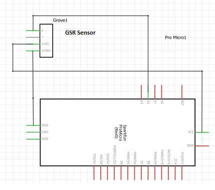
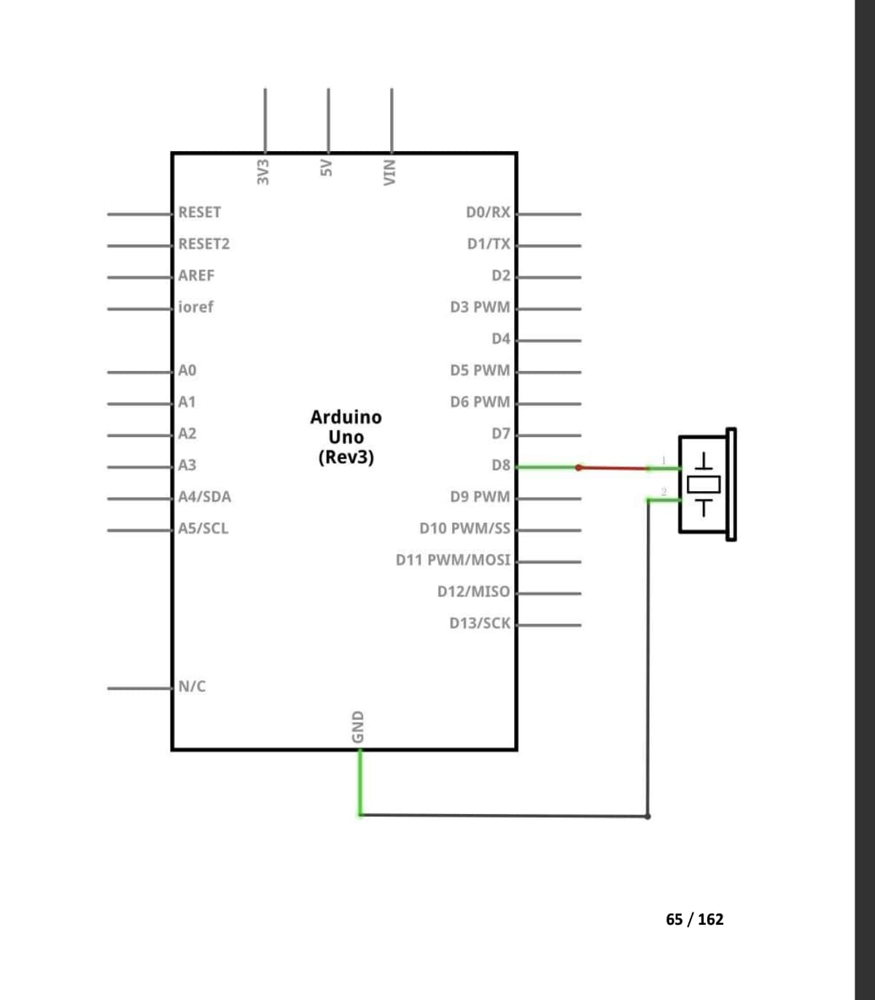

# Lie Detector 
I'm building a lie detector that uses a Galvanic Skin Response(GSR) sensor to detect signs of stress that may indicate lying. The Arduino reads data from both sensors and looks for sudden drops in skin conductivity. If a potential lie is detected, the Arduino activates a vibration motor. This project combines biometric sensing with real-time signal analysis and feedback using simple hardware components.

| **Engineer** | **School** | **Area of Interest** | **Grade** |
|:--:|:--:|:--:|:--:|
| Anthony D | Leland HS | Programming | Incoming Sophmore


 <p align="center">

 </p>
  
<!--# Final Milestone

**Don't forget to replace the text below with the embedding for your milestone video. Go to Youtube, click Share -> Embed, and copy and paste the code to replace what's below.**

<iframe width="560" height="315" src="https://www.youtube.com/embed/F7M7imOVGug" title="YouTube video player" frameborder="0" allow="accelerometer; autoplay; clipboard-write; encrypted-media; gyroscope; picture-in-picture; web-share" allowfullscreen></iframe>

For your final milestone, explain the outcome of your project. Key details to include are:
- What you've accomplished since your previous milestone
- What your biggest challenges and triumphs were at BSE
- A summary of key topics you learned about
- What you hope to learn in the future after everything you've learned at BSE


# Second Milestone

**Don't forget to replace the text below with the embedding for your milestone video. Go to Youtube, click Share -> Embed, and copy and paste the code to replace what's below.**

<iframe width="560" height="315" src="https://www.youtube.com/embed/y3VAmNlER5Y" title="YouTube video player" frameborder="0" allow="accelerometer; autoplay; clipboard-write; encrypted-media; gyroscope; picture-in-picture; web-share" allowfullscreen></iframe>

For your second milestone, explain what you've worked on since your previous milestone. You can highlight:
- Technical details of what you've accomplished and how they contribute to the final goal
- What has been surprising about the project so far
- Previous challenges you faced that you overcame
- What needs to be completed before your final milestone -->

# First Milestone

<iframe width="560" height="315" src="https://www.youtube.com/embed/29TEZYm_xy0?si=oztg0rRBki9wiKQS" title="YouTube video player" frameborder="0" allow="accelerometer; autoplay; clipboard-write; encrypted-media; gyroscope; picture-in-picture; web-share" referrerpolicy="strict-origin-when-cross-origin" allowfullscreen></iframe>

<!--For your first milestone, describe what your project is and how you plan to build it. You can include:
- An explanation about the different components of your project and how they will all integrate together
- Technical progress you've made so far
- Challenges you're facing and solving in your future milestones
- What your plan is to complete your project -->

# Schematics 
 <p align="center">

 </p>

Above is the schematics for the GSR sensor 

 <p align="center">

 </p>

 Above is schematics for the vibration motor


# Code
This code first calculates the your GSR for 10 seconds then takes the average of them to create the baseline. Next, it reads your GSR and determines if your lieing based off whether or not you have passed the threshold value of 25.

```c++
#define NOTE_E5  659

//-----------------------------------------------------------------------

const int GSR = A2;
int sensorValue = 0;
int gsr_average = 0;
int baseline = 0;
bool calibrated = false;
bool lie = false;
const int sampleCount = 500;
const int thresholdDrop = 25; 
int sampleInterval = 1;
int count = 0;
int baselineReadings[10];
int readingIndex = 0;


void setup() {
  Serial.begin(9600);
  delay(2000);
  Serial.println("Calibrating baseline...");

  Serial.println("Stay still for 10 seconds...");
  
  int sum = 0;
  int totalSum =0;
  int readingIndex = 0;
  unsigned long startTime = millis();
  unsigned long duration = 10000; // 10
  unsigned long lastPrintTime = millis();

  while (millis() - startTime <= duration) {
    int localSum = 0;
    
    for (int i = 0; i < 10; i++) {
      sensorValue = analogRead(GSR);
      localSum += sensorValue;
      delay(1); 
    }
 
  if (millis() - lastPrintTime >= 1000) {
    baseline = localSum / 10;
    Serial.print((millis() - startTime) / 1000);
    Serial.print(" GSR: ");
    Serial.println(baseline);
    baselineReadings[readingIndex] = baseline;
    
    readingIndex++;
   
    lastPrintTime += 1000;
  }

  }

  // average baseline
  for (int i = 0; i < readingIndex; i++) {
    totalSum += baselineReadings[i];
  }
  baseline = totalSum / readingIndex;

  Serial.println("-----------------------------");
  Serial.print("Baseline GSR average: ");
  Serial.println(baseline);
  Serial.println("-----------------------------");
  delay(2000);
}


 
void loop() {
//read gsr
  int sensorValue = 0; 
  int sum = 0;
  int gsr_average = 0;
  for (int i = 0; i < 10; i++) {
    sensorValue = analogRead(GSR);
    sum += sensorValue;
    delay(1);
  }

  gsr_average = sum / 10;
  Serial.print("GSR: ");
  Serial.print(gsr_average);

  // check gsr drop
  if (baseline - gsr_average > thresholdDrop) 
  {
    Serial.println(" LIE DETECTED");
    if(!lie){
    tone(5,NOTE_E5, 1000);
    lie = true;

    }
   

  }  
    else {
    Serial.println(" NORMAL");
    lie = false;

  }
  delay(1000);
  
}
```

<!--# Bill of Materials
Here's where you'll list the parts in your project. To add more rows, just copy and paste the example rows below.
Don't forget to place the link of where to buy each component inside the quotation marks in the corresponding row after href =. Follow the guide [here]([url](https://www.markdownguide.org/extended-syntax/)) to learn how to customize this to your project needs. 

| **Part** | **Note** | **Price** | **Link** |
|:--:|:--:|:--:|:--:|
| Item Name | What the item is used for | $Price | <a href="https://www.amazon.com/Arduino-A000066-ARDUINO-UNO-R3/dp/B008GRTSV6/"> Link </a> |
| Item Name | What the item is used for | $Price | <a href="https://www.amazon.com/Arduino-A000066-ARDUINO-UNO-R3/dp/B008GRTSV6/"> Link </a> |
| Item Name | What the item is used for | $Price | <a href="https://www.amazon.com/Arduino-A000066-ARDUINO-UNO-R3/dp/B008GRTSV6/"> Link </a> |-->

# Starter Project: Jitterbug


<iframe width="560" height="315" src="https://www.youtube.com/embed/0aJ8D_24M1k?si=ZHzQcDe4stBDzNmZ" title="YouTube video player" frameborder="0" allow="accelerometer; autoplay; clipboard-write; encrypted-media; gyroscope; picture-in-picture; web-share" referrerpolicy="strict-origin-when-cross-origin" allowfullscreen></iframe>


 The **[Jitterbug](https://learntosolderkits.com/products/jitterbug)** involved soldering ca vibration motor, two red LEDs, a switch, and a battery holder onto a custom PCB. Once completed, the Jitterbug uses the motor to skitter across hard surfaces. I really enjoyed this starter project since it allowed me to learn how to solder and really got me into the mood for my summer at BlueStamp.
 <p align="center">

 </p>


# Challenges
A major challenge I faced was that one of the jitterbugs eyes were not lighting up. After playing with it I realized that the issue was that the led was oriented the wrong way. To fix this, I had to desolder the LED, flip it around, and finally put it back in and solder it. **From this I learned how to desolder and take out components.**


# Components Used

- 1 x Jitterbug PCB
- 2 x LED (Red)
- 1 x Vibration Motor
- 1 x Switch
- 1 x Coin Cell Battery (3V)
- 1 x Battery Holder
- 1 x Cut Wire


