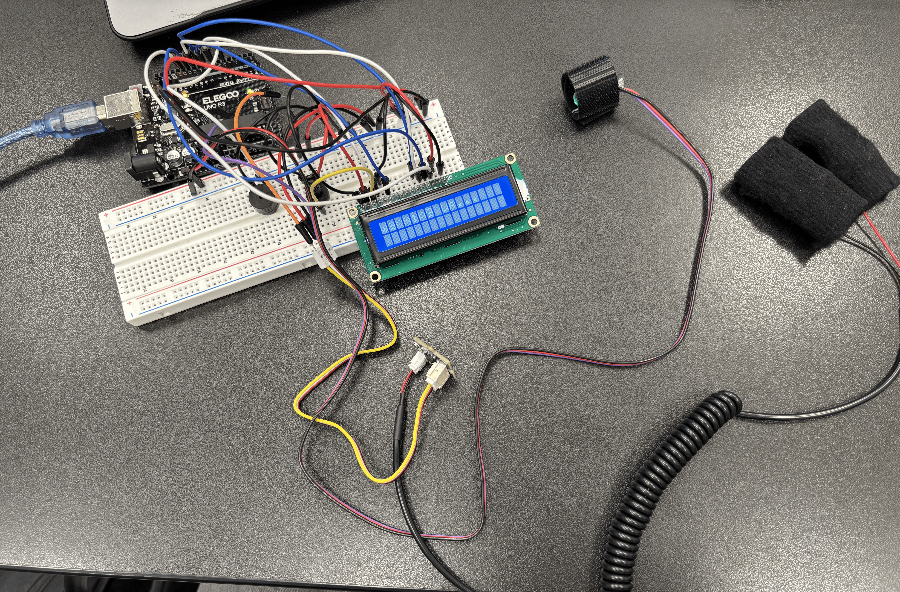
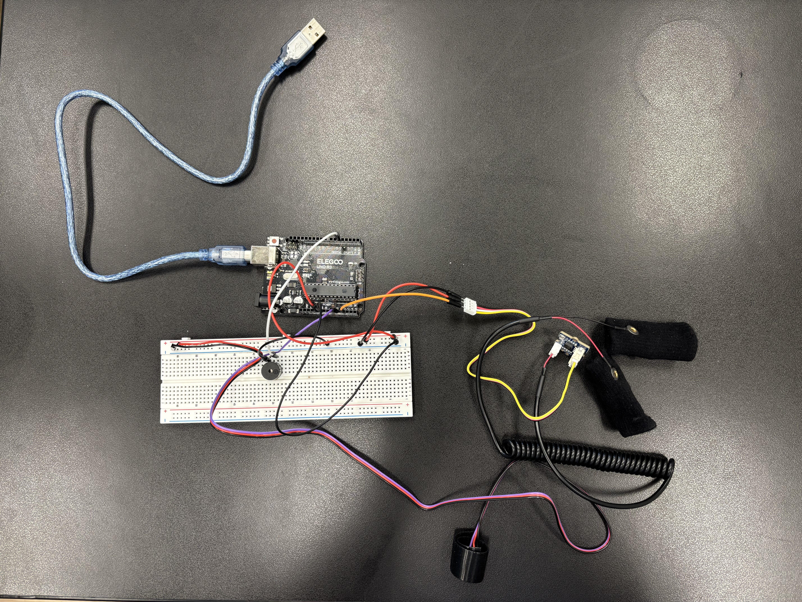
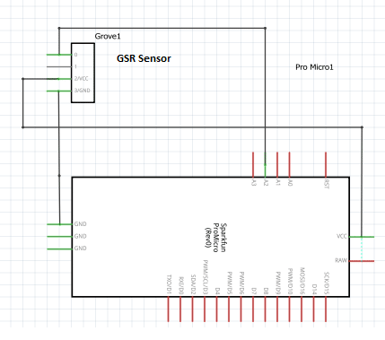
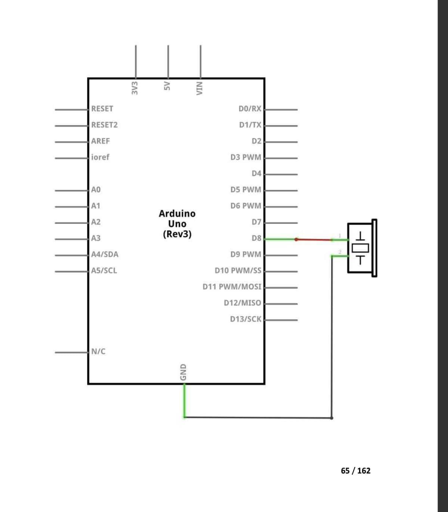
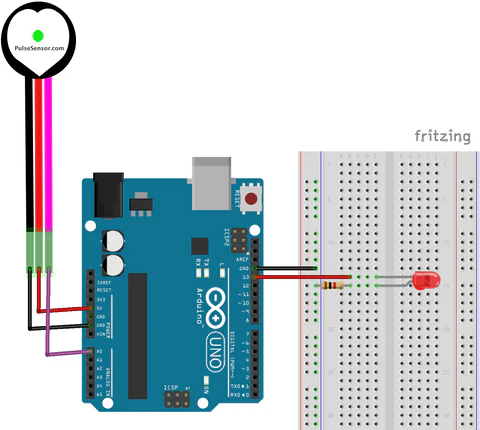

# Lie Detector 
I'm building a lie detector that uses a Galvanic Skin Response(GSR) sensor to detect signs of stress that may indicate lying. The Arduino reads data from both sensors and looks for sudden drops in skin conductivity. If a potential lie is detected, the Arduino activates a vibration motor. This project combines biometric sensing with real-time signal analysis and feedback using simple hardware components.

| **Engineer** | **School** | **Area of Interest** | **Grade** |
|:--:|:--:|:--:|:--:|
| Anthony D | Leland HS | Programming | Incoming Sophmore


 <p align="center">

 </p>
 


# Final Milestone

<iframe width="560" height="315" src="https://www.youtube.com/embed/dEcS0x2d0PI?si=dq5pf3JnY4kedbfv" title="YouTube video player" frameborder="0" allow="accelerometer; autoplay; clipboard-write; encrypted-media; gyroscope; picture-in-picture; web-share" referrerpolicy="strict-origin-when-cross-origin" allowfullscreen></iframe>

After many ups and downs I have finally reached my 3rd and final milestone for my project! For this milestone, I added a LCD display. I added this display for the purpose of allowing the user to look at their GSR and heartbeat without having to have to look at my computer.

Adding on, I also increased the accuracy of both sensors by ensuring that the rates were stable before doing the actual lie detection. To do this I wrote code to ensure that the sensors would output values that were close to each other at least 10-20 times in order to move on from the baseline calibration.

 <p align="center">

 </p>
 <p align="center">
My final project!
 </p>


# Challenges

A major challenge I faced was installing my LCD screen. The first time I installed it, I thought I had all the wires in the right place, but unfortunately I did not which caused my arduino to short circuit. Before trying again, I took a look at was wrong and I figured out that I had accidentally put the voltage pin into the ground rail, which caused the arduino to short. M


For your final milestone, explain the outcome of your project. Key details to include are:
- What you've accomplished since your previous milestone
- What your biggest challenges and triumphs were at BSE
- A summary of key topics you learned about
- What you hope to learn in the future after everything you've learned at BSE  

# Second Milestone


<iframe width="560" height="315" src="https://www.youtube.com/embed/KK1g4qwSJLM?si=a0iQGYZuhzBqP7ZP" title="YouTube video player" frameborder="0" allow="accelerometer; autoplay; clipboard-write; encrypted-media; gyroscope; picture-in-picture; web-share" referrerpolicy="strict-origin-when-cross-origin" allowfullscreen></iframe>

My goal for my 2nd milestone to my lie detector project was to not only use a GSR sensor to detect if someone is lying but also using a heartbeat sensor. Using a finger pulse sensor, I was able to detect someones heartbeat, create a baseline and detect if someone is lying based of that threshold. The pulse sensor shines red and infrared light through your fingertip and measure how much light is absorbed. This allows the sensor to calculate the oxygen saturation level and pulse rate.


 <p align="center">

 </p>
 <p align="center">
Heartbeat sensor successfully added using a breadboard.
 </p>


# Challenges

At first, I thought I wouldn't have any issues with the pulse sensor but I was quite suprised to learn that my pulse sensor needed time to warm up. This was a major roadblock for me becuase I had no idea how to implement a warmup to my code. However, after some tries, I figured out a way to warm up the pulse sensor by continously getting the heartbeat until it was the range of a real hearbeat until finally starting the baseline calibration.

# Next Steps

A problem as you can see in the video is that I need to show you my computer to see your heartbeat and GSR , so to fix this I hope to add a LCD display so that the user can see their heartbeat and GSR in real time. Moreover, I hope to add a moving average to cancel out any bad readings and I also hope to make my heartbeat sensor calibration better since as you can see in the video, it is inconsistent.


# First Milestone

<iframe width="560" height="315" src="https://www.youtube.com/embed/29TEZYm_xy0?si=oztg0rRBki9wiKQS" title="YouTube video player" frameborder="0" allow="accelerometer; autoplay; clipboard-write; encrypted-media; gyroscope; picture-in-picture; web-share" referrerpolicy="strict-origin-when-cross-origin" allowfullscreen></iframe>

For my first milestone, I successfully integrated the GSR sensor with an Arduino to detect g stress-related changes in skin conductivity. I programmed the Arduino to create a baseline and used simple threshold to identify sudden drops in GSR values, which may indicate stress or a potential lie. When such a change is detected, the Arduino triggers a vibration motor to alert that a lie has been detected This milestone markes the first functional version of my lie detector.
 <p align="center">

 </p>

# Challenges

Initially, I used a timer-based approach to calculate the baseline by averaging GSR sensor readings over a set period of time. However, I noticed that the values collected this way were different from the ones I got during the actual lie detection test, where I was using a for loop to gather data. This mismatch created inconsistency between the baseline and live readings, making the lie detection less reliable.

To solve this, I modified my approach by combining both methods. I kept the for loop for consistent data collection but controlled it using a timer. This allowed me to gather a fixed number of sensor readings, ensuring the baseline was calculated using the same method and timing structure as the readings taken during the actual test. This change improved the accuracy and consistency of my system.

# Next Steps
My next steps are to improve the accuracy of the lie detector by smoothing out the GSR values using techniques like moving averages to reduce noise and random fluctuations. I also plan to create a personalized "lying threshold" based on user input. I will ask the user to intentionally lie a few times so the GSR sensor can record their stress response patterns. This data will help establish a more accurate threshold for detecting real lies later. Additionally, I plan to integrate a heartbeat sensor to track changes in pulse rate alongside skin conductivity. By combining both biometric signals, the lie detector will be able to make more reliable and confident predictions.


<!--For your first milestone, describe what your project is and how you plan to build it. You can include:
- An explanation about the different components of your project and how they will all integrate together
- Technical progress you've made so far
- Challenges you're facing and solving in your future milestones
- What your plan is to complete your project -->

# Schematics 
 <p align="center">

 </p>
 <p align="center">
Above is the schematics for the GSR sensor 
 </p>

 <p align="center">

 </p>
 <p align="center">
 Above is schematics for the vibration motor
 </p>

  <p align="center">

 </p>
 <p align="center">
Above is the schematics for the pulse sensor
 </p>
 


# Code
This code first calculates the your GSR for 10 seconds then takes the average of them to create the baseline. Next, it reads your GSR and determines if your lieing based off whether or not you have passed the threshold value of 25.

```c++
#include <PulseSensorPlayground.h>
#include <LiquidCrystal.h>
#define NOTE_E5  659
#define NOTE1 800


//--

//vars
const int PulseWire = 0;  


const int GSR = A2;
const int Threshold = 550;

const int requiredStableGSR = 20;
int gsrStableCount = 0;
int gsrLast = 0;
int gsrSum = 0;
const int gsrTolerance = 5;

int sensorValue = 0;
int gsr_average = 0;
int baseline = 0;
bool lie = false;
int totalSum = 0;
int avgBpm = 0;
const int thresholdDrop = 25;
int readingIndex = 0;
int baselineReadings[10];
int myBPM = 0;
int bpmSum =0;
int gsr=0;
int bpmThreshold = 5;

PulseSensorPlayground pulseSensor;

LiquidCrystal lcd(7, 8, 9, 10, 11, 12);

void setup() {
  Serial.begin(9600);
  lcd.begin(16, 2);
  lcd.print("Warming up...");
  pulseSensor.analogInput(PulseWire);
  pulseSensor.setThreshold(Threshold);
  pulseSensor.begin();

  Serial.println("Warming up PulseSensor...");
  unsigned long warmupStart = millis();
  const int requiredStableReadings = 10;
  int stableReadings = 0;
  int lastBPM = 0;
  int count = 0;

  //pulsesensor wwarmup

  while (stableReadings < requiredStableReadings) {
    if (pulseSensor.sawStartOfBeat()) {
      for (int i = 0; i < 10; i++) {
        pulseSensor.sawNewSample();
        pulseSensor.outputSample();
        delay(2);
      }

      int bpm = pulseSensor.getBeatsPerMinute();
      if (bpm > 50 && bpm < 120) {
        if (abs(bpm - lastBPM) < 2 && lastBPM != 0) {
          stableReadings++;
          bpmSum += bpm;
          count++;
          Serial.print("Stable BPM: ");
          Serial.println(bpm);
        } else {
          stableReadings = 0;
        }
        lastBPM = bpm;
      } else {
        stableReadings = 0;
        lastBPM = 0;
      }

    
      lcd.clear();
      lcd.setCursor(0, 0);
      lcd.print("Warming up BPM");
      lcd.setCursor(0, 1);
      lcd.print("BPM: ");
      lcd.print(bpm);
    }

    delay(20);
  }

  avgBpm = bpmSum / count;
  Serial.println("PulseSensor ready.");
  Serial.print("Base BPM: ");
  Serial.println(avgBpm);

  lcd.clear();
  lcd.setCursor(0, 0);
  lcd.print("Base BPM: ");
  lcd.setCursor(10, 0);
  lcd.print(avgBpm);

  delay(2000);
  lcd.clear();
  lcd.setCursor(0, 0);
  lcd.print("Wait 10 sec pls");
  Serial.println("Wait 10 sec pls");

//gsr warmup
Serial.println("Calibrating GSR...");
lcd.clear();
lcd.setCursor(0, 0);
lcd.print("Calibrating GSR");
delay(1000);

while (gsrStableCount < requiredStableGSR) {
  int localSum = 0;
  for (int i = 0; i < 10; i++) {
    sensorValue = analogRead(GSR);
    localSum += sensorValue;
    delay(1);
  }
  int gsrReading = localSum / 10;

  if (gsrStableCount == 0 || abs(gsrReading - gsrLast) <= gsrTolerance) {
    gsrSum += gsrReading;
    gsrStableCount++;
    gsrLast = gsrReading;


    lcd.clear();
    lcd.setCursor(0, 0);
    lcd.print("Stable GSR");
    lcd.setCursor(0, 1);
    lcd.print("Val: ");
    lcd.print(gsrReading);
  } else {
    Serial.print("Unstable GSR: ");
    Serial.print(gsrReading);
    Serial.print(" vs ");
    Serial.println(gsrLast);
    gsrStableCount = 0;
    gsrSum = 0;
    lcd.clear();
    lcd.setCursor(0, 0);
    lcd.print("Unstable GSR...");
    lcd.setCursor(0, 1);
    lcd.print("Retrying...");
    delay(1000);
  }

  delay(500);
}

baseline = gsrSum / requiredStableGSR;


Serial.print("Stable GSR: ");
Serial.println(baseline);

lcd.clear();
lcd.setCursor(0, 0);
lcd.print("Baseline GSR:");
lcd.setCursor(0, 1);
lcd.print(baseline);
delay(2000);

}

void loop() {
  int sum = 0;
  for (int i = 0; i < 10; i++) {
    sensorValue = analogRead(GSR);
    sum += sensorValue;
    delay(1);
  }

  if (pulseSensor.sawStartOfBeat()) {
    for (int i = 0; i < 10; i++) {
      pulseSensor.sawNewSample();
      pulseSensor.outputSample();
      delay(2);
    }
    myBPM = pulseSensor.getBeatsPerMinute();
  }

  gsr_average = sum / 10;

  lcd.clear();
  lcd.setCursor(0, 0);
  lcd.print("BPM: ");
  lcd.print(myBPM);
  lcd.setCursor(0, 1);
  lcd.print("GSR: ");
  lcd.print(gsr_average);
  //lie detect

if ((baseline - gsr_average > thresholdDrop) && (myBPM > bpmThreshold)) {
  lcd.setCursor(10, 1);
  lcd.print("LIE!");
  Serial.println(" LIE DETECTED"); 
  if (!lie) {
    tone(5, NOTE_E5, 1000); 
    lie = true;
  }
} else {
  lcd.setCursor(10, 1);
  lcd.print("     ");  
  Serial.println(" NORMAL");
  lie = false;
}

delay(1000);
}


```

# Bill of Materials
Here's where you'll list the parts in your project. To add more rows, just copy and paste the example rows below.
Don't forget to place the link of where to buy each component inside the quotation marks in the corresponding row after href =. Follow the guide [here]([url](https://www.markdownguide.org/extended-syntax/)) to learn how to customize this to your project needs. 

| **Part** | **Note** | **Price** | **Link** |
|:--:|:--:|:--:|:--:|
| GSR sensor | Used to detect how much you sweat.| $12 | <a href="https://www.seeedstudio.com/Grove-GSR-sensor-p-1614.html"> Link </a> |
| Finger Pulssensor | Used to determine your heartbeat | $29 | <a href="https://pulsesensor.com/products/new-ring-bundle"> Link </a> |
|ELEGOO Ardunio Uno Starter Kit| LCD Display and Piezo Buzzer | $43 | <a href="https://us.elegoo.com/products/elegoo-uno-r3-super-starter-kit?srsltid=AfmBOoo0Mqo5qU166GWTCoQqZWDo6ggsjd_S013AzcrnyVcMvj5E5Tdz"> Link </a> |

# Starter Project: Jitterbug


<iframe width="560" height="315" src="https://www.youtube.com/embed/0aJ8D_24M1k?si=ZHzQcDe4stBDzNmZ" title="YouTube video player" frameborder="0" allow="accelerometer; autoplay; clipboard-write; encrypted-media; gyroscope; picture-in-picture; web-share" referrerpolicy="strict-origin-when-cross-origin" allowfullscreen></iframe>


 The **[Jitterbug](https://learntosolderkits.com/products/jitterbug)** involved soldering ca vibration motor, two red LEDs, a switch, and a battery holder onto a custom PCB. Once completed, the Jitterbug uses the motor to skitter across hard surfaces. I really enjoyed this starter project since it allowed me to learn how to solder and really got me into the mood for my summer at BlueStamp.
 <p align="center">

 </p>


# Challenges
A major challenge I faced was that one of the jitterbugs eyes were not lighting up. After playing with it I realized that the issue was that the led was oriented the wrong way. To fix this, I had to desolder the LED, flip it around, and finally put it back in and solder it. **From this I learned how to desolder and take out components.**


# Components Used

- 1 x Jitterbug PCB
- 2 x LED (Red)
- 1 x Vibration Motor
- 1 x Switch
- 1 x Coin Cell Battery (3V)
- 1 x Battery Holder
- 1 x Cut Wire


